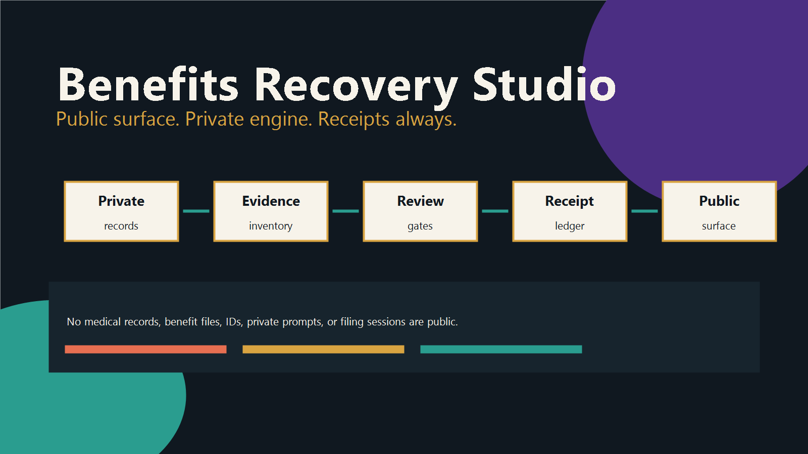
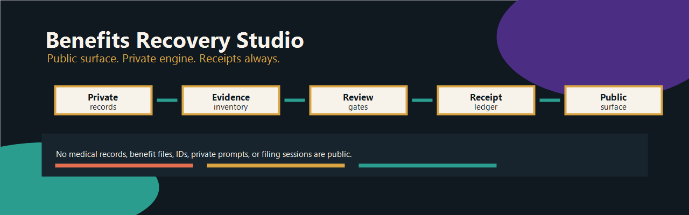
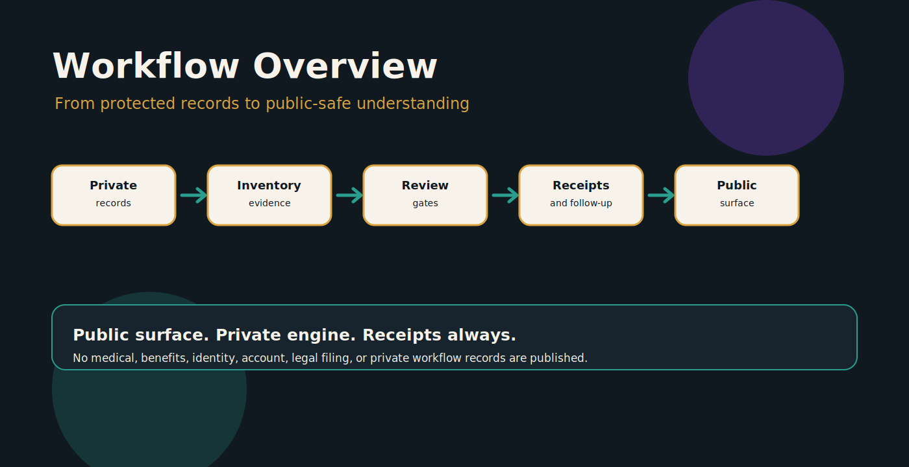
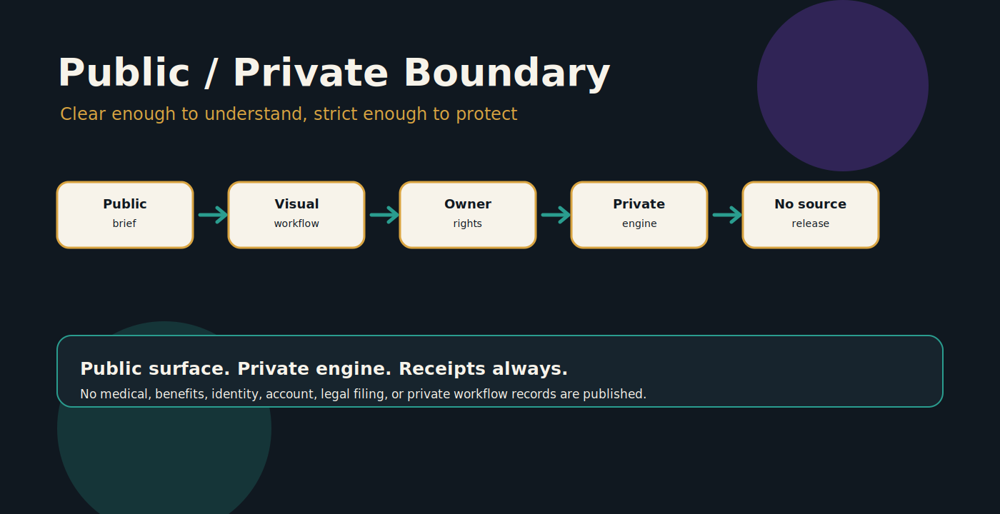
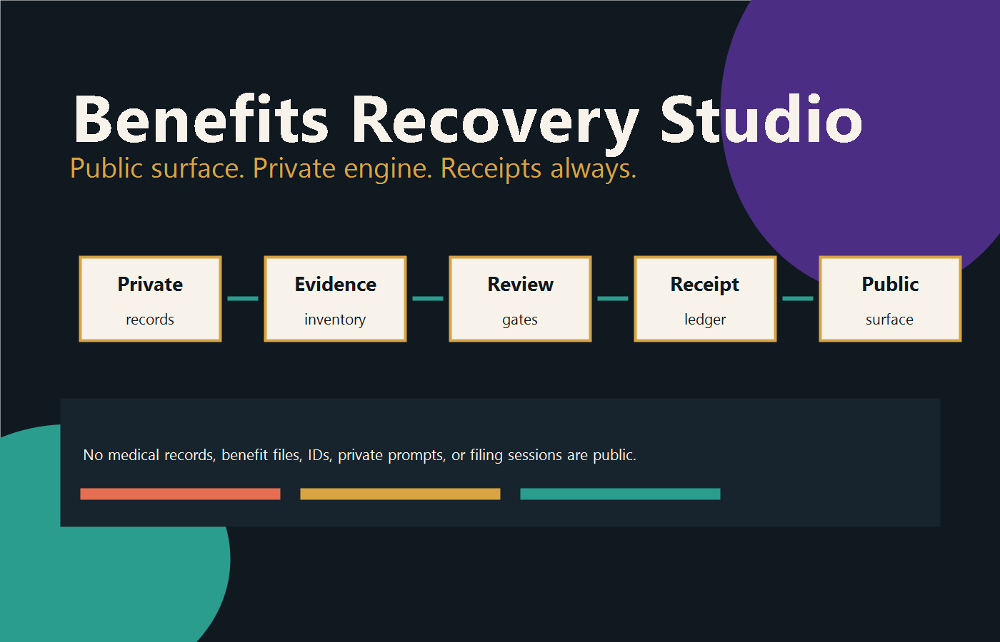

# Benefits Recovery Studio

Benefits Recovery Studio is a protected public project surface for a privacy-preserving administrative recovery workflow. It documents how complex paperwork, benefit notices, evidence packets, deadlines, and follow-up loops can be organized without exposing the private records underneath.

> This repository is a protected public project surface. It is not the full source code, operational system, private workflow, or data room.

## Why It Matters

Administrative systems often ask disabled people, caregivers, working families, and people under stress to manage dense forms, deadlines, proofs, notices, calls, and portals at the exact moment their capacity is lowest. Benefits Recovery Studio treats paperwork survival as infrastructure: evidence ledgers, clear status, reversible packets, review gates, and receipts.

## Who It Is For

This surface is for people evaluating Faith Cheltenham's administrative recovery, document-ops, accessibility, and protected-workflow approach: collaborators, institutions, advocates, civic-tech builders, journalists, funders, and partners who need the high-level model without access to private records.

## How It Works

The public model is simple:

1. gather local records and notices;
2. classify what is public-safe, private, or blocked;
3. build answer banks, receipt ledgers, and follow-up trackers;
4. prepare review packets and scripts;
5. keep human legal signatures and final submissions gated;
6. publish only the project surface, not the private engine.

## Public / Private Boundary

Public materials explain the method, values, ownership, and high-level workflow. Private materials include actual forms, medical records, benefit notices, identity records, filing sessions, prompts, local automation, account access, legal signatures, and private receipts.

## Visual Gallery

The visual system uses calm contrast, clear boundaries, and human review gates: private records stay protected; public understanding stays strong.

## Current Status

- Public export status: created and populated on GitHub via GitHub CLI.
- Repository slug: `benefits-recovery-studio`.
- Version status: v1 slug available during GitHub CLI check on 2026-06-18.
- Website draft: prepared for https://faithcheltenham.com/projects/benefits-recovery-studio/.
- Privacy posture: ready after Faith review.

## Learn More

- Website draft path: `/projects/benefits-recovery-studio/`
- Owner site: [FaithCheltenham.com](https://faithcheltenham.com/)
- Public repository URL: [https://github.com/thefayth/benefits-recovery-studio](https://github.com/thefayth/benefits-recovery-studio)

All rights reserved. No source release. No public license. No redistribution. No training permission. No commercial reuse.
